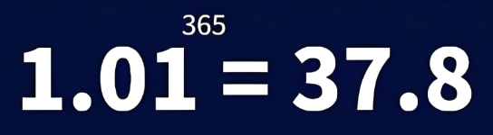

<!-- docs/_sidebar.md -->

<a href="#/" class="sidebar-link"> 十方斋</a>
 

---

- <b><i class="fas fa-business-time"></i> 开始这里</b>
  - [我在记录什么](/docs/开始/我在记录什么.md)
  - [什么是复利](/docs/开始/神奇的复利效应.md)
  - [为什么我把定投和SellPut放在一起](/docs/开始/为什么我把定投和SellPut放在一起.md)
  - [新手阅读顺序](/docs/开始/新手阅读顺序.md) 

- <b><i class="fas fa-chart-line"></i> 长期复利框架</b> 
  - [定投的底层逻辑](/docs/复利/定投的底层逻辑.md)
  - [为什么长期持有能产生复利](/docs/复利/为什么长期持有能产生复利.md)
  - [ETF定投方法](/docs/复利/ETF定投方法.md)
  
- <b><i class="fas fa-chart-line"></i>Sell Put策略</b> 
  - [投资大师竟然是这么“买”股票的！](/docs/SellPut/学习大师如何买股票.md)
  - [如何Sell Put?](/docs/SellPut/如何SellPut.md)
  - [SellPut和定投结合](/docs/SellPut/SellPut和定投结合.md)
  <!-- - [行权价怎么选](/docs/SellPut/行权价怎么选.md) -->
  <!-- - [安全垫怎么计算](/docs/SellPut/安全垫怎么计算.md) -->
  <!-- - [年化收益怎么判断](/docs/SellPut/年化收益怎么判断.md) -->
  <!-- - [什么情况下提前买回](/docs/SellPut/什么情况下提前买回.md) -->
  <!-- - [Sell Put 风险与边界](/docs/SellPut/SellPut风险与边界.md) -->
 
- <b><i class="fas fa-chart-line"></i>市场结构观察</b> 
  - [每日市场判断怎么看](/docs/市场/每日市场判断怎么看.md)
  - [📊 今日市场](/docs/市场/今日.md)
  - [📚 历史归档](/docs/市场/历史.md)

- <b><i class="fas fa-chart-line"></i> 资产与市场</b> 
  - [港美股基础](/docs/资产与市场/港美股基础.md)
  - [ETF](/docs/资产与市场/ETF.md)
  - [美债投资指南](/docs/资产与市场/美债投资指南.md)
  - [黄金与避险资产](/docs/资产与市场/黄金与避险资产.md)
  - [比特币与高波动资产](/docs/资产与市场/比特币与高波动资产.md)
  - [纳指/标普/恒科](/docs/资产与市场/纳指标普恒科.md)
    

- <b><i class="fas fa-chart-line"></i> 券商与工具</b>  
  - [港美股券商介绍](/docs/券商与工具/港美股券商介绍.md)  
  - [券商开户教程](/docs/券商与工具/券商开户教程.md)  
  - [香港银行账户介绍](/docs/券商与工具/香港银行账户介绍.md)
  - [入金与出金说明](/docs/券商与工具/入金与出金说明.md)

- <b><i class="fas fa-chart-line"></i> 其他</b>  
  - [联系](/docs/其他/联系.md)
